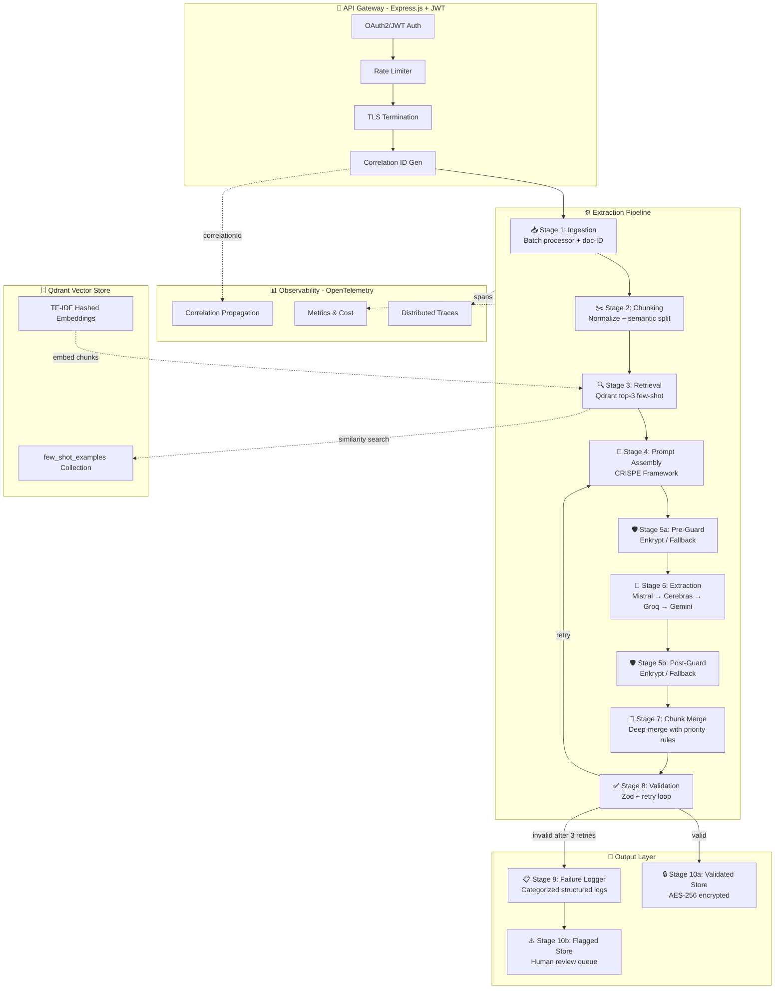

# 🧬 Constrained Structured Extraction at Scale

<div align="center">


**A production-grade, 10-stage AI extraction pipeline that converts messy, unstructured documents into strictly validated, schema-compliant JSON — achieving 100% success rate across contracts, chat logs, and support tickets.**

[Live Demo](#-live-demo) · [Architecture](#-architecture) · [Quick Start](#-quick-start) · [Evaluation Report](#-evaluation-results) · [Deployment](#-deployment)

</div>

---

## 🎯 Problem Statement

> *AdaptX AI Engineer Hackathon Challenge: Build an autonomous system that extracts structured data from noisy, real-world unstructured text and achieves ≥90% schema validity without regex fallbacks.*

Real-world documents are messy. Contracts have inconsistent formatting, chat logs mix timestamps with emojis, and support tickets contain nested technical jargon. This system transforms all of them into validated, type-safe JSON using nothing but LLMs, advanced prompt engineering, and autonomous self-correction — **zero regex in the extraction path**.

---

## ✨ Key Highlights

<table>
<tr>
<td align="center" width="25%">

### 🏆 100%
**Schema Validity**<br/>
<sub>20-doc official evaluation</sub>

</td>
<td align="center" width="25%">

### ⚡ 4-Tier
**LLM Fallback**<br/>
<sub>Mistral → Cerebras → Groq → Gemini</sub>

</td>
<td align="center" width="25%">

### 🛡️ Dual
**Guardrails**<br/>
<sub>Pre & Post extraction checks</sub>

</td>
<td align="center" width="25%">

### 🔒 AES-256
**Encrypted Output**<br/>
<sub>At-rest encryption with GCM</sub>

</td>
</tr>
</table>

---

## 🏗️ Architecture

The system is built as a **10-stage sequential pipeline** with autonomous retry loops, multi-provider fallback, and full observability:



### Pipeline Stages in Detail

| # | Stage | Description | Technology |
|---|-------|-------------|------------|
| 1 | **Ingestion** | Accepts raw text, assigns UUID document IDs and correlation IDs | Express.js |
| 2 | **Chunking** | Normalizes whitespace, splits large documents at semantic boundaries | Custom splitter |
| 3 | **Retrieval** | Retrieves top-3 similar few-shot examples via cosine similarity | Qdrant (in-memory) |
| 4 | **Prompt Assembly** | Builds CRISPE-framework prompts with schema constraints + few-shot examples | Mastra-inspired |
| 5 | **Guardrails** | Dual checkpoint (pre/post) — PII redaction, prompt injection blocking, hallucination detection | Enkrypt AI / OSS fallback |
| 6 | **Extraction** | 4-tier LLM fallback with per-provider rate limiters and structured JSON output mode | Mistral, Cerebras, Groq, Gemini |
| 7 | **Chunk Merge** | Deep-merges chunked extractions using null-safe priority rules | Custom merger |
| 8 | **Validation** | Strict Zod schema validation with self-correction retry loop (up to 3×) | Zod |
| 9 | **Failure Logger** | Categorizes every failure type without silently dropping data | Structured logging |
| 10 | **Output Store** | AES-256-GCM encryption for valid outputs; plaintext flagged store for review | Node.js crypto |

---

## 📊 Evaluation Results

Official evaluation on 20 synthetic documents designed to push the pipeline to its limits:

```
┌─────────────────────────────────────────────────────┐
│                 EVALUATION RESULTS                   │
├─────────────────────────┬───────────────────────────┤
│  Total Documents        │  20                       │
│  Schema-Valid Outputs   │  20                       │
│  Success Rate           │  100.0% ✅                │
│  Average Latency (p95)  │  35.13s                   │
│  Average Retries/Doc    │  0.60                     │
│  Average Cost/Doc       │  $0.0006                  │
│  Total Evaluation Time  │  372.6s                   │
├─────────────────────────┼───────────────────────────┤
│  Contracts              │  8/8   (100%)             │
│  Chat Logs              │  6/6   (100%)             │
│  Support Tickets        │  6/6   (100%)             │
├─────────────────────────┼───────────────────────────┤
│  Primary Provider       │  Mistral (no fallback     │
│                         │  needed for this run)     │
└─────────────────────────┴───────────────────────────┘
```

> Full evaluation report with failure analysis: [`output/report.md`](output/report.md)

---

## 📁 Project Structure

```
├── src/
│   ├── config/                   # Zod-validated env config
│   ├── gateway/                  # Express.js API gateway (JWT, rate limiting, TLS)
│   ├── pipeline/                 # Pipeline orchestrator with retry logic
│   ├── public/                   # Demo web frontend (single-page)
│   ├── schema/                   # JSON schemas per document type
│   ├── types/                    # TypeScript type definitions
│   ├── observability/            # OpenTelemetry tracing & metrics
│   ├── stage01-ingestion/        # Document intake & ID assignment
│   ├── stage02-chunking/         # Semantic text chunking
│   ├── stage03-retrieval/        # Qdrant few-shot retrieval
│   ├── stage04-prompt-assembly/  # CRISPE prompt builder
│   ├── stage05-guardrails/       # Enkrypt AI / fallback guardrails
│   ├── stage06-extraction/       # Multi-provider LLM extraction
│   ├── stage07-chunk-merge/      # JSON deep-merge with conflict resolution
│   ├── stage08-validation/       # Zod schema validation + retry
│   ├── stage09-failure-logger/   # Structured failure categorization
│   └── stage10-output-store/     # AES-256-GCM encrypted output storage
├── data/
│   ├── samples/                  # 50 synthetic test documents
│   └── few-shot-examples/        # Curated few-shot training pairs
├── scripts/
│   ├── evaluate.ts               # Evaluation harness (20-doc demo / 50-doc full)
│   └── seed-qdrant.ts            # Vector store seeding script
├── docs/
│   ├── PRD.md                    # Product Requirements Document
│   ├── PROMPTS.md                # Prompt engineering documentation
│   ├── SECURITY.md               # Security & guardrails architecture
│   └── OBSERVABILITY.md          # OpenTelemetry & metrics guide
├── output/
│   └── report.md                 # Latest evaluation report
├── DEPLOY.md                     # Deployment guide (Railway/Render)
├── package.json
└── tsconfig.json
```

---

## 🚀 Quick Start

### Prerequisites

- **Node.js** ≥ 20.0.0
- **npm** ≥ 9

### Installation

```bash
# Clone the repository
git clone https://github.com/YourUsername/AdaptX-AI-Engineer-Hackathon.git
cd AdaptX-AI-Engineer-Hackathon

# Install dependencies
npm install
```

### Configuration

```bash
# Copy the environment template
cp .env.example .env
```

Add your API keys to `.env`:

```env
# Required (at least one LLM provider)
MISTRAL_API_KEY=your_mistral_key        # Primary
CEREBRAS_API_KEY=your_cerebras_key      # 2nd fallback
GROQ_API_KEY=your_groq_key             # 3rd fallback
GEMINI_API_KEY=your_gemini_key          # 4th fallback

# Security
JWT_SECRET=your_64_char_hex_secret
AES_ENCRYPTION_KEY=your_64_char_hex_key

# Demo mode (bypasses JWT for /extract endpoint)
DEMO_MODE=true
```

### Run the Demo Server

```bash
npm run dev
```

Open **http://localhost:3000** in your browser to access the web demo interface.

### Run the Evaluation Suite

```bash
# Demo subset (20 documents — ~6 minutes)
npm run evaluate

# Full suite (50 documents — ~22 minutes)
npm run evaluate:full
```

### Build for Production

```bash
npm run build
npm start
```

---

## 🖥️ Live Demo

The web interface provides a complete interactive demo:

1. **Select a document type** — Contract, Chat Log, or Support Ticket
2. **Load a pre-built sample** — or paste your own messy text
3. **Click "Extract Structured Data"** — watch the 10-stage pipeline process it
4. **View syntax-highlighted JSON** — with live metrics (latency, tokens, cost, provider)

### API Endpoints

| Method | Endpoint | Description |
|--------|----------|-------------|
| `GET` | `/` | Web demo interface |
| `GET` | `/health` | Health check + status |
| `POST` | `/extract` | Extract structured data from text |

#### `POST /extract` — Example

```bash
curl -X POST http://localhost:3000/extract \
  -H "Content-Type: application/json" \
  -d '{
    "text": "SERVICE AGREEMENT between Acme Corp and TechStart Inc...",
    "documentType": "contract"
  }'
```

**Response:**
```json
{
  "success": true,
  "documentType": "contract",
  "data": {
    "contractTitle": "Service Agreement",
    "parties": [
      { "name": "Acme Corp", "role": "provider" },
      { "name": "TechStart Inc", "role": "client" }
    ],
    "totalContractValue": 50000,
    "governingLaw": "California"
  },
  "providersUsed": ["mistral"],
  "metrics": {
    "totalLatencyMs": 8877,
    "totalTokens": 9012,
    "estimatedCostUsd": 0.0009
  }
}
```

---

## 🛡️ Security & Guardrails

| Layer | Feature | Details |
|-------|---------|---------|
| 🔐 **Authentication** | JWT (RS256) | Configurable via `JWT_SECRET` |
| 🚦 **Rate Limiting** | Token bucket | Per-provider + per-endpoint limiting |
| 🔒 **Encryption** | AES-256-GCM | All validated outputs encrypted at rest |
| 🛡️ **Pre-Guard** | Content filtering | PII redaction, prompt injection blocking |
| 🛡️ **Post-Guard** | Output validation | Hallucination detection, structural checks |
| 📋 **Audit Trail** | Correlation IDs | End-to-end tracing per document |

---

## 🔄 Failure Modes & Mitigation

The pipeline handles four categories of failure, documented in detail in [`output/report.md`](output/report.md):

| Failure Mode | Mitigation |
|---|---|
| **Null required fields** | Retry with augmented error-path prompt → flag for human review |
| **Chunk-merge conflicts** | Merge-priority rule: null can never overwrite a non-null value |
| **Rate limiting (429)** | Per-provider token-bucket + 4-tier LLM fallback chain |
| **Hallucination risk** | Dual guardrail checkpoints + strict Zod schema validation |

---

## 🛠️ Tech Stack

<div align="center">

| Category | Technology |
|----------|-----------|
| **Runtime** | Node.js 20+, TypeScript 5.x |
| **Primary LLM** | Mistral AI (`mistral-large-latest`) |
| **Fallback LLMs** | Cerebras, Groq, Google Gemini |
| **Vector Store** | Qdrant (in-memory mode) |
| **Schema Validation** | Zod |
| **API Framework** | Express.js |
| **Security** | Helmet, CORS, JWT (`jose`), AES-256-GCM |
| **Guardrails** | Enkrypt AI / Open-source fallback |
| **Observability** | OpenTelemetry (traces + metrics) |
| **Prompt Framework** | CRISPE (Mastra-inspired) |

</div>

---

## ☁️ Deployment

The project is deployment-ready for **Railway**, **Render**, or any Node.js hosting platform.

See [`DEPLOY.md`](DEPLOY.md) for full instructions.

```bash
# Build & start
npm run build
npm start

# Required env vars for deployment
PORT=3000              # Auto-injected by most platforms
DEMO_MODE=true         # Bypasses JWT for demo access
MISTRAL_API_KEY=...    # At least one LLM key required
JWT_SECRET=...
AES_ENCRYPTION_KEY=...
```

---

## 📜 Documentation

| Document | Description |
|----------|-------------|
| [PRD.md](docs/PRD.md) | Full Product Requirements Document |
| [PROMPTS.md](docs/PROMPTS.md) | Prompt engineering architecture (CRISPE) |
| [SECURITY.md](docs/SECURITY.md) | Security model & guardrails design |
| [OBSERVABILITY.md](docs/OBSERVABILITY.md) | OpenTelemetry setup & failure taxonomy |
| [DEPLOY.md](DEPLOY.md) | Deployment guide for Railway/Render |

---

## 👥 Team

Built for the **AdaptX AI Engineer Hackathon** by **AntiGravity**.

---

<div align="center">

**⭐ Star this repo if you found it useful!**

*Built with 🧠 advanced prompt engineering, 🔒 enterprise-grade security, and ☕ way too much coffee.*

</div>
