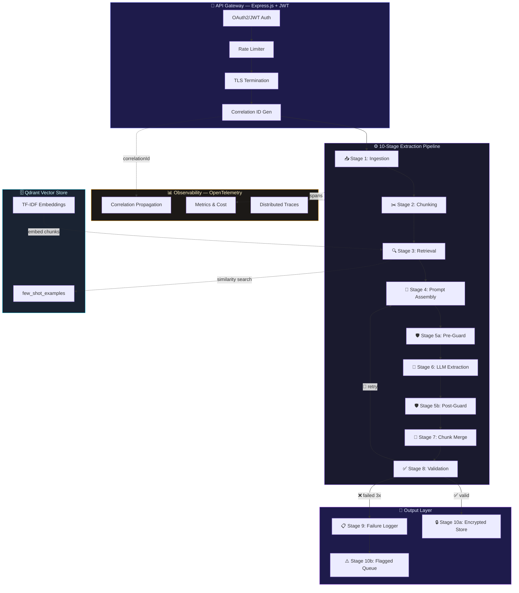

<div align="center">

<a href="https://git.io/typing-svg"></a>

<br/>


<br/>

<a href="#-quick-start">
  
</a>
<a href="#-architecture">
  
</a>
<a href="#-evaluation-results">
  
</a>
<a href="#-live-demo">
  
</a>
<a href="#-deployment">
  
</a>

</div>

<br/>


## 🎯 The Challenge

<table>
<tr>
<td width="60%">

> **AdaptX AI Engineer Hackathon** — Build an autonomous system that extracts structured data from noisy, real-world unstructured text and achieves **≥90% schema validity** without regex fallbacks.

Real-world documents are _messy_. Contracts have inconsistent formatting, chat logs mix timestamps with emojis, and support tickets contain nested technical jargon.

This system transforms **all of them** into validated, type-safe JSON using nothing but LLMs, advanced prompt engineering, and autonomous self-correction — **zero regex in the extraction path**.

</td>
<td width="40%" align="center">

```
  ┌──────────────┐
  │  📄 Messy    │
  │  Unstructured│
  │  Documents   │
  └──────┬───────┘
         │
    ⚡ 10-Stage Pipeline
         │
  ┌──────▼───────┐
  │  ✅ Clean    │
  │  Schema-Valid│
  │  JSON Output │
  └──────────────┘
```

</td>
</tr>
</table>


## ✨ Key Highlights

<div align="center">

<table>
<tr>
<td align="center" width="20%">
<br/>
<sub><b>Schema Validity</b></sub><br/>
<sup>20-doc official eval</sup>
</td>
<td align="center" width="20%">
<br/>
<sub><b>Zero Downtime</b></sub><br/>
<sup>Mistral→Cerebras→Groq→Gemini</sup>
</td>
<td align="center" width="20%">
<br/>
<sub><b>At-Rest Security</b></sub><br/>
<sup>GCM authenticated</sup>
</td>
<td align="center" width="20%">
<br/>
<sub><b>Pre & Post Guard</b></sub><br/>
<sup>Hallucination detection</sup>
</td>
<td align="center" width="20%">
<br/>
<sub><b>Ultra Low Cost</b></sub><br/>
<sup>Free-tier optimized</sup>
</td>
</tr>
</table>

</div>


## 🏗️ Architecture

<div align="center">



</div>

### 📋 Pipeline Stages

<div align="center">

| # | Stage | What It Does | Tech |
|:---:|-------|-------------|:----:|
| `01` | **Ingestion** | Accepts raw text, assigns UUID document & correlation IDs | Express |
| `02` | **Chunking** | Normalizes whitespace, splits large docs at semantic boundaries | Custom |
| `03` | **Retrieval** | Retrieves top-3 similar few-shot examples via cosine similarity | Qdrant |
| `04` | **Prompt Assembly** | Builds CRISPE-framework prompts with schema + few-shot examples | Mastra |
| `05` | **Guardrails** | Dual checkpoint — PII redaction, injection blocking, hallucination detection | Enkrypt |
| `06` | **Extraction** | 4-tier LLM fallback with per-provider rate limiters + JSON mode | Mistral |
| `07` | **Chunk Merge** | Deep-merges chunked extractions using null-safe priority rules | Custom |
| `08` | **Validation** | Strict Zod schema validation with self-correction retry (up to 3×) | Zod |
| `09` | **Failure Logger** | Categorizes every failure type without silently dropping data | Logger |
| `10` | **Output Store** | AES-256-GCM encryption for valid outputs; flagged store for review | Crypto |

</div>

### ⚡ LLM Fallback Chain

```
╔═══════════════╗    ╔═══════════════╗    ╔═══════════════╗    ╔═══════════════╗
║   🥇 MISTRAL  ║───▶║  🥈 CEREBRAS  ║───▶║   🥉 GROQ     ║───▶║  🏅 GEMINI    ║
║   (Primary)   ║    ║ (2nd Fallback)║    ║ (3rd Fallback)║    ║(Final Fallback)║
║  30 RPM Limit ║    ║  30 RPM Limit ║    ║  30 RPM Limit ║    ║  15 RPM Limit ║
╚═══════════════╝    ╚═══════════════╝    ╚═══════════════╝    ╚═══════════════╝
     ▲ 429?               ▲ 429?               ▲ 429?
     └─ Try next ──────────┘─ Try next ──────────┘─ Try next ──────────┘
```


## 📊 Evaluation Results

<div align="center">

<table>
<tr>
<td align="center">

### 🏆 Official 20-Doc Evaluation

</td>
</tr>
</table>

<table>
<tr>
<td align="center" width="16%">
<h3>📄 20</h3>
<sub>Documents<br/>Processed</sub>
</td>
<td align="center" width="16%">
<h3>✅ 20</h3>
<sub>Schema-Valid<br/>Outputs</sub>
</td>
<td align="center" width="16%">
<h3>🏆 100%</h3>
<sub>Success<br/>Rate</sub>
</td>
<td align="center" width="16%">
<h3>⏱️ 372.6s</h3>
<sub>Total<br/>Runtime</sub>
</td>
<td align="center" width="16%">
<h3>💰 $0.0006</h3>
<sub>Avg Cost<br/>Per Doc</sub>
</td>
<td align="center" width="16%">
<h3>🔄 0.60</h3>
<sub>Avg Retries<br/>Per Doc</sub>
</td>
</tr>
</table>

<br/>

<table>
<tr>
<td align="center" width="33%">

### 📑 Contracts


<sup>Service agreements, NDAs,<br/>consulting engagements</sup>

</td>
<td align="center" width="33%">

### 💬 Chat Logs


<sup>Customer support chats,<br/>multi-turn conversations</sup>

</td>
<td align="center" width="33%">

### 🎫 Support Tickets


<sup>Bug reports, escalations,<br/>technical issues</sup>

</td>
</tr>
</table>

</div>

> 📝 Full evaluation report with failure analysis: [`output/report.md`](output/report.md)


## 🖥️ Live Demo

<div align="center">

<table>
<tr>
<td>

The web interface provides a complete interactive demo:

**1.** Select a document type — `Contract` / `Chat Log` / `Support Ticket`<br/>
**2.** Load a pre-built sample — or paste your own messy text<br/>
**3.** Click **"⚡ Extract Structured Data"** — watch the pipeline process it<br/>
**4.** View syntax-highlighted JSON — with live metrics (latency, tokens, cost)

</td>
</tr>
</table>

</div>

### 🔌 API Endpoints

| Method | Endpoint | Auth | Description |
|:------:|----------|:----:|-------------|
| `GET` | `/` | 🔓 Open | Web demo interface |
| `GET` | `/health` | 🔓 Open | Health check + status |
| `POST` | `/extract` | 🔓 Demo Mode | Extract structured data from text |
| `POST` | `/api/extract` | 🔐 JWT | Production extraction endpoint |

### 📡 Example Request

```bash
curl -X POST http://localhost:3000/extract \
  -H "Content-Type: application/json" \
  -d '{
    "text": "SERVICE AGREEMENT between Acme Corp and TechStart Inc...",
    "documentType": "contract"
  }'
```

<details>
<summary>📤 <b>Click to expand response</b></summary>

```json
{
  "success": true,
  "documentType": "contract",
  "data": {
    "contractTitle": "Service Agreement",
    "contractType": "service_agreement",
    "effectiveDate": "Jan 15 2024",
    "parties": [
      { "name": "Acme Corp", "role": "provider" },
      {
        "name": "TechStart Inc",
        "role": "client",
        "signatoryName": "Jane Smith",
        "signatoryTitle": "CEO"
      }
    ],
    "paymentTerms": [
      { "amount": 50000, "currency": "USD", "frequency": "one_time" }
    ],
    "totalContractValue": 50000,
    "governingLaw": "California",
    "executionDate": "Jan 15 2024"
  },
  "providersUsed": ["mistral"],
  "metrics": {
    "totalLatencyMs": 8877,
    "totalTokens": 9012,
    "retryCount": 2,
    "estimatedCostUsd": 0.0009
  }
}
```

</details>


## 🛡️ Security Architecture

<div align="center">

```
┌─────────────────────────────────────────────────────────────────┐
│                    🔐 SECURITY LAYERS                           │
├─────────┬─────────┬──────────┬──────────┬──────────┬───────────┤
│  JWT    │  Rate   │  Pre-    │  Post-   │ AES-256  │ Audit     │
│  Auth   │  Limit  │  Guard   │  Guard   │ Encrypt  │ Trail     │
│ (RS256) │ (Token) │ (PII/   │ (Hallu-  │ (GCM at  │ (Corr.    │
│         │ Bucket) │ Inject)  │ cination)│ rest)    │ IDs)      │
└─────────┴─────────┴──────────┴──────────┴──────────┴───────────┘
```

</div>

| Layer | Feature | Details |
|:-----:|---------|---------|
| 🔐 | **Authentication** | JWT RS256 via `jose` — configurable secret |
| 🚦 | **Rate Limiting** | Per-provider token-bucket + per-endpoint limits |
| 🛡️ | **Pre-Guard** | PII redaction · prompt injection blocking |
| 🛡️ | **Post-Guard** | Hallucination detection · structural consistency |
| 🔒 | **Encryption** | AES-256-GCM authenticated encryption at rest |
| 📋 | **Audit Trail** | End-to-end correlation ID propagation via OpenTelemetry |


## 🔄 Failure Modes & Mitigation

<details>
<summary><b>1. Required Fields Returned as Null</b> — <code>wrong_type</code></summary>

> **Root Cause:** Source document genuinely lacks the information the schema requires.
>
> **Mitigation:** System fails validation and retries with an augmented prompt including the exact Zod error path. If data truly doesn't exist, the document is flagged for human review with a clear reason code — never hallucinated.

</details>

<details>
<summary><b>2. Chunk-Merge Conflicts</b> — <code>merge_conflict</code></summary>

> **Root Cause:** Awkward chunk split boundaries cause one chunk to return `null` for a field another chunk correctly extracted.
>
> **Mitigation:** Merge-priority rule — a `null` value can **never** overwrite an already-populated non-null value. First valid value wins. Full audit trail logged.

</details>

<details>
<summary><b>3. Rate-Limit 429 Errors</b> — <code>rate_limited</code></summary>

> **Root Cause:** Free-tier LLM APIs impose aggressive TPM/RPM quotas.
>
> **Mitigation:** Per-provider token-bucket rate limiter + 4-tier fallback chain (Mistral → Cerebras → Groq → Gemini). Pipeline degrades gracefully across independent quotas.

</details>

<details>
<summary><b>4. Hallucination Risk</b> — <code>guardrail</code></summary>

> **Root Cause:** LLMs may fabricate plausible but nonexistent values.
>
> **Mitigation:** Dual guardrail checkpoints (Enkrypt AI or open-source fallback) + strict Zod schema validation as a structural safeguard. No fabricated value can bypass type/enum/format constraints.

</details>


## 📁 Project Structure

```
📦 AdaptX-AI-Engineer-Hackathon
├── 🌐 src/
│   ├── config/                   # Zod-validated env config
│   ├── gateway/                  # Express.js API gateway (JWT, rate limiting, TLS)
│   ├── pipeline/                 # Pipeline orchestrator with retry logic
│   ├── public/                   # Demo web frontend (single-page)
│   ├── schema/                   # JSON schemas per document type
│   ├── types/                    # TypeScript type definitions
│   ├── observability/            # OpenTelemetry tracing & metrics
│   ├── stage01-ingestion/        # 📥 Document intake & ID assignment
│   ├── stage02-chunking/         # ✂️ Semantic text chunking
│   ├── stage03-retrieval/        # 🔍 Qdrant few-shot retrieval
│   ├── stage04-prompt-assembly/  # 📝 CRISPE prompt builder
│   ├── stage05-guardrails/       # 🛡️ Enkrypt AI / fallback guardrails
│   ├── stage06-extraction/       # 🤖 Multi-provider LLM extraction
│   ├── stage07-chunk-merge/      # 🔗 JSON deep-merge with conflict resolution
│   ├── stage08-validation/       # ✅ Zod schema validation + retry
│   ├── stage09-failure-logger/   # 📋 Structured failure categorization
│   └── stage10-output-store/     # 🔒 AES-256-GCM encrypted storage
├── 📊 data/
│   ├── samples/                  # 50 synthetic test documents
│   └── few-shot-examples/        # Curated few-shot training pairs
├── 🧪 scripts/
│   ├── evaluate.ts               # Evaluation harness (20-doc / 50-doc)
│   └── seed-qdrant.ts            # Vector store seeding
├── 📚 docs/                      # PRD, Prompts, Security, Observability
├── 📈 output/report.md           # Latest evaluation report
├── ☁️ DEPLOY.md                   # Railway/Render deployment guide
└── 📦 package.json
```


## 🚀 Quick Start

### Prerequisites


### Installation

```bash
# Clone the repository
git clone https://github.com/VexedPainter/AdaptX-AI-Engineer-Hackathon.git
cd AdaptX-AI-Engineer-Hackathon

# Install dependencies
npm install
```

### Configuration

```bash
cp .env.example .env
```

Add your API keys to `.env`:

```env
# Required (at least one LLM provider)
MISTRAL_API_KEY=your_mistral_key        # 🥇 Primary
CEREBRAS_API_KEY=your_cerebras_key      # 🥈 2nd fallback
GROQ_API_KEY=your_groq_key             # 🥉 3rd fallback
GEMINI_API_KEY=your_gemini_key          # 🏅 4th fallback

# Security
JWT_SECRET=your_64_char_hex_secret
AES_ENCRYPTION_KEY=your_64_char_hex_key

# Demo mode (bypasses JWT for /extract)
DEMO_MODE=true
```

### Run

```bash
# 🌐 Start demo server (open http://localhost:3000)
npm run dev

# 🧪 Run 20-doc evaluation (~6 min)
npm run evaluate

# 🧪 Run full 50-doc evaluation (~22 min)
npm run evaluate:full

# 🏗️ Production build
npm run build && npm start
```


## 🛠️ Tech Stack

<div align="center">

<table>
<tr>
<td align="center" width="100">
<br/>
<sub><b>TypeScript</b></sub>
</td>
<td align="center" width="100">
<br/>
<sub><b>Node.js</b></sub>
</td>
<td align="center" width="100">
<br/>
<sub><b>Express.js</b></sub>
</td>
<td align="center" width="100">
<br/>
<sub><b>Zod</b></sub>
</td>
</tr>
<tr>
<td align="center" width="100">
<sub>🤖</sub><br/>
<sub><b>Mistral AI</b></sub>
</td>
<td align="center" width="100">
<sub>🧠</sub><br/>
<sub><b>Cerebras</b></sub>
</td>
<td align="center" width="100">
<sub>⚡</sub><br/>
<sub><b>Groq</b></sub>
</td>
<td align="center" width="100">
<sub>♊</sub><br/>
<sub><b>Gemini</b></sub>
</td>
</tr>
<tr>
<td align="center" width="100">
<sub>🗄️</sub><br/>
<sub><b>Qdrant</b></sub>
</td>
<td align="center" width="100">
<sub>📊</sub><br/>
<sub><b>OpenTelemetry</b></sub>
</td>
<td align="center" width="100">
<sub>🛡️</sub><br/>
<sub><b>Enkrypt AI</b></sub>
</td>
<td align="center" width="100">
<sub>🔒</sub><br/>
<sub><b>AES-256-GCM</b></sub>
</td>
</tr>
</table>

</div>


## ☁️ Deployment

The project is deployment-ready for **Railway**, **Render**, or any Node.js platform.

```bash
npm run build    # Compiles TypeScript + copies static assets
npm start        # Runs dist/gateway/server.js
```

> 📖 Full deployment guide: [`DEPLOY.md`](DEPLOY.md)


## 📜 Documentation

| Document | Description |
|:--------:|-------------|
| [`PRD.md`](docs/PRD.md) | Full Product Requirements Document |
| [`PROMPTS.md`](docs/PROMPTS.md) | Prompt engineering architecture (CRISPE) |
| [`SECURITY.md`](docs/SECURITY.md) | Security model & guardrails design |
| [`OBSERVABILITY.md`](docs/OBSERVABILITY.md) | OpenTelemetry setup & failure taxonomy |
| [`DEPLOY.md`](DEPLOY.md) | Deployment guide for Railway / Render |
| [`report.md`](output/report.md) | Official evaluation report |


## 👥 Team

<div align="center">

Built for the **AdaptX AI Engineer Hackathon** by **AntiGravity**

<br/>

**⭐ Star this repo if you found it useful!**

<br/>

<i>Built with 🧠 advanced prompt engineering, 🔒 enterprise-grade security, and ☕ way too much coffee.</i>

</div>


