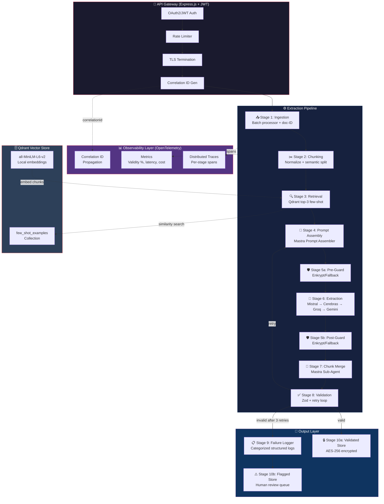

# Product Requirements Document — Constrained Structured Extraction at Scale

> **Version**: 1.1  
> **Last Updated**: 2026-07-19  
> **Project**: AI Engineer Internship Hackathon — AdaptX  
> **Author**: Auto-generated from architectural specification

---

## 1. Executive Summary

This system extracts structured JSON (matching strict nested schemas) from noisy real-world text — contracts, chat logs, and support tickets — achieving **>90% schema-valid output** across ≥50 samples with **zero hardcoded regex fallbacks** in the extraction path. The pipeline uses Mastra for agent orchestration, Qdrant for few-shot retrieval, Enkrypt AI (with open-source fallback) for guardrails, and **Mistral** as the primary LLM, cascading down to Cerebras, Groq, and Google Gemini as fallbacks to ensure robust evaluation despite strict free-tier rate limits.

---

## 2. Architecture Diagram

---

## 3. Functional Requirements

| ID | Requirement | Acceptance Threshold | Module | Verification |
|------|-------------|---------------------|--------|-------------|
| **FR-101** | System SHALL ingest raw text documents of types: contract, chat log, support ticket | 3 document types supported | `stage01-ingestion` | Unit test: ingest each type |
| **FR-102** | System SHALL support batch ingestion of ≥50 documents per batch | Batch size ≥ 50 | `stage01-ingestion` | Unit test: batch of 50 |
| **FR-103** | System SHALL assign a unique parent-doc-ID (UUID v4) to each document at ingestion | 100% of documents get unique IDs | `stage01-ingestion` | Unit test: ID uniqueness |
| **FR-104** | System SHALL normalize text (Unicode NFC, whitespace collapse, encoding fixes) before chunking | All input sanitized before chunking | `stage02-chunking` | Unit test: normalize edge cases |
| **FR-105** | System SHALL split documents using semantic-boundary chunking (paragraph/section breaks) | No mid-sentence splits | `stage02-chunking` | Unit test: chunk boundary quality |
| **FR-106** | Each chunk SHALL carry parent-doc-ID and order-index metadata | 100% of chunks have both fields | `stage02-chunking` | Unit test: metadata presence |
| **FR-107** | System SHALL retrieve top-3 few-shot examples per chunk via Qdrant similarity search | Exactly 3 examples returned per chunk | `stage03-retrieval` | Unit test: retrieval count |
| **FR-108** | Few-shot examples SHALL be type-matched (contract examples for contract chunks) | 100% type-match rate | `stage03-retrieval` | Unit test: type filtering |
| **FR-109** | Mastra Prompt Assembler SHALL merge schema + few-shot examples + chunk into a single constrained prompt | Prompt contains all 3 components | `stage04-prompt-assembly` | Unit test: prompt structure |
| **FR-110** | Pre-Guard SHALL sanitize input: block prompt injection and redact PII before LLM call | 100% of inputs pass through pre-guard | `stage05-guardrails` | Unit test: injection detection |
| **FR-111** | Post-Guard SHALL scan generated JSON for unsafe or hallucinated content | 100% of outputs pass through post-guard | `stage05-guardrails` | Unit test: hallucination detection |
| **FR-112** | LLM extraction SHALL use constrained structured-output mode (function calling or JSON schema) | Zero free-form text outputs | `stage06-extraction` | Unit test: output is valid JSON |
| **FR-113** | System SHALL implement provider-aware rate-limit retry queues (Mistral, Cerebras, Groq, Gemini) | Queue + backoff per provider, no hard errors on 429 | `stage06-extraction` | Unit test: rate limit handling |
| **FR-114** | Chunk-Merge Agent SHALL reassemble multi-chunk partial JSON into one nested object | Correct merge for ≥3-chunk documents | `stage07-chunk-merge` | Unit test: multi-chunk merge |
| **FR-115** | Chunk-Merge Agent SHALL resolve field conflicts using parent-doc-ID priority | Conflicts resolved without data loss | `stage07-chunk-merge` | Unit test: conflict resolution |
| **FR-116** | Schema Validator SHALL validate output against Zod schemas with detailed error traces | Errors include path + expected + received | `stage08-validation` | Unit test: error trace format |
| **FR-117** | On validation failure, system SHALL re-prompt with exact error trace (max 3 retries) | Retry loop ≤ 3 attempts | `stage08-validation` | Unit test: retry count enforcement |
| **FR-118** | Failure Logger SHALL categorize every failure into structured categories | ≥5 distinct failure categories | `stage09-failure-logger` | Unit test: category coverage |
| **FR-119** | Validated JSON SHALL be stored with AES-256 encryption at rest | Encrypted files unreadable without key | `stage10-output-store` | Unit test: encrypt/decrypt round-trip |
| **FR-120** | Rejected items SHALL be stored in a separate flagged store for human review | Flagged items queryable by correlationId | `stage10-output-store` | Unit test: flagged store retrieval |
| **FR-121** | Pipeline SHALL contain ZERO hardcoded regex fallbacks in extraction or merge paths | 0 regex patterns in extraction code | `all stages` | Code review: grep for regex usage |

---

## 4. Non-Functional Requirements

| ID | Requirement | Threshold | Module | Verification |
|------|-------------|-----------|--------|-------------|
| **NFR-201** | Schema-validity rate across 50+ samples | ≥ 90% | `evaluate.ts` | Evaluation report |
| **NFR-202** | p95 end-to-end latency per document | ≤ 30 seconds | `observability` | Metrics export |
| **NFR-203** | Average retries per successful record | ≤ 1.5 retries | `evaluate.ts` | Evaluation report |
| **NFR-204** | Cost per record (LLM token cost) | ≤ $0.01 USD | `observability` | Cost calculation |
| **NFR-205** | API gateway response time (auth + rate check) | ≤ 50ms | `gateway` | Load test |
| **NFR-206** | Rate limiting: sustained throughput without 429 errors | ≥ 10 requests/minute | `gateway` | Evaluation run stability |
| **NFR-207** | All service-to-service calls use TLS where feasible | TLS enabled when certs provided | `gateway` | Configuration verification |
| **NFR-208** | Zero secrets hardcoded in source code | 0 hardcoded secrets | `all modules` | Code review: grep for API keys |
| **NFR-209** | Every pipeline stage instrumented with OpenTelemetry spans | 11 span types recorded | `observability` | Trace export review |
| **NFR-210** | Correlation ID propagated through all stages | 100% of spans have correlationId | `observability` | Trace attribute check |
| **NFR-211** | Every module independently unit-testable | ≥ 1 test per module | `tests/` | `npm test` passes |
| **NFR-212** | Prompt parameters logged per call (hash, temp, top_p, tokens) | 100% of LLM calls logged | `stage06-extraction` | Log audit |

---

## 5. Traceability Matrix

| Requirement | Implementing Module(s) | Verification Method |
|-------------|----------------------|---------------------|
| FR-101, FR-102, FR-103 | `src/stage01-ingestion/` | Unit tests: `tests/stage01.test.ts` |
| FR-104, FR-105, FR-106 | `src/stage02-chunking/` | Unit tests: `tests/stage02.test.ts` |
| FR-107, FR-108 | `src/stage03-retrieval/` | Unit tests: `tests/stage03.test.ts` |
| FR-109 | `src/stage04-prompt-assembly/` | Unit tests: `tests/stage04.test.ts` |
| FR-110, FR-111 | `src/stage05-guardrails/` | Unit tests: `tests/stage05.test.ts` |
| FR-112, FR-113 | `src/stage06-extraction/` | Unit tests: `tests/stage06.test.ts` |
| FR-114, FR-115 | `src/stage07-chunk-merge/` | Unit tests: `tests/stage07.test.ts` |
| FR-116, FR-117 | `src/stage08-validation/` | Unit tests: `tests/stage08.test.ts` |
| FR-118 | `src/stage09-failure-logger/` | Unit tests: `tests/stage09.test.ts` |
| FR-119, FR-120 | `src/stage10-output-store/` | Unit tests: `tests/stage10.test.ts` |
| FR-121 | All extraction/merge code | `grep -rn "new RegExp\|/.*/" src/stage0{4,6,7}/` returns 0 results |
| NFR-201, NFR-203, NFR-204 | `scripts/evaluate.ts` | Evaluation run → `report.md` |
| NFR-202 | `src/observability/` | Metrics export analysis |
| NFR-205, NFR-206 | `src/gateway/` | API gateway load test |
| NFR-207 | `src/gateway/server.ts` | TLS configuration verification |
| NFR-208 | All modules | `grep -rn "sk-\|AIza\|gsk_" src/` returns 0 results |
| NFR-209, NFR-210 | `src/observability/` | Trace export review |
| NFR-211 | `tests/` | `npm test` all pass |
| NFR-212 | `src/stage06-extraction/`, `src/observability/` | Log audit |

---

## 6. Technology Stack

| Component | Technology | Justification |
|-----------|-----------|---------------|
| Language | TypeScript (Node.js ≥20) | Mastra is TypeScript-native; strict types improve reliability |
| Agent Orchestration | Mastra (`@mastra/core`) | Required tool; workflow graph + sub-agent support |
| Vector Store | Qdrant (`@qdrant/js-client-rest`) | Required tool; in-memory mode for hackathon |
| Guardrails | Enkrypt AI + open-source fallback | Required tool; dual-mode for flexibility |
| Primary LLM | Mistral (free tier, mistral-large-latest) | Highest token-per-minute quota for batch evaluation of 50+ large prompts. JSON-mode extraction. |
| Fallback 1 | Cerebras (free tier, llama3.1-8b) | Ultra-fast LLaMA 3.1 fallback via OpenAI-compatible endpoint. |
| Fallback 2 | Groq (free tier, llama-3.1-8b-instant) | Retained as a secondary fallback. |
| Fallback 3 | Google Gemini 2.0 Flash (free tier) | Retained as fully wired final fallback with dedicated rate limiter. |
| Schema Validation | Zod | TypeScript-native Pydantic equivalent |
| API Gateway | Express.js + jose + express-rate-limit | Lightweight Kong alternative |
| Tracing | OpenTelemetry SDK | Industry standard, vendor-neutral |
| Encryption | Node.js `crypto` (AES-256-GCM) | Built-in, no external dependency |
| Embeddings | `@xenova/transformers` (all-MiniLM-L6-v2) | Local inference, zero API cost |
| Testing | Vitest | Fast, ESM-native, TypeScript-first |

---

## 7. Out of Scope (Hackathon)

- Persistent Qdrant deployment (in-memory is documented as a known limitation)
- Production Kubernetes/Docker orchestration
- Multi-tenant isolation
- Real-time streaming ingestion
- Custom model fine-tuning
- Full UI dashboard (API-only for hackathon)
